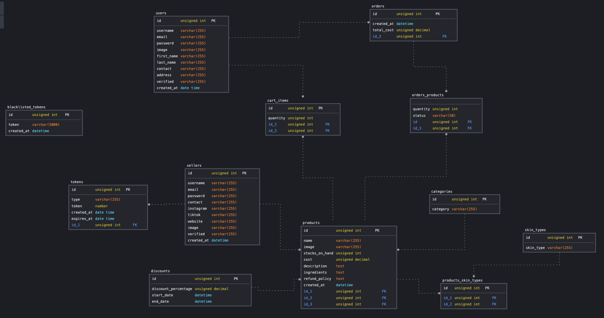

# LuxeSkin Haven Backend

## Project Overview
LuxeSkin Haven is an e-commerce platform dedicated to providing luxurious skincare products to customers seeking high-quality and effective skincare solutions. The platform aims to create a seamless and enjoyable shopping experience for skincare enthusiasts, connecting them with premium skincare brands and products.

The backend API handles data management, user authentication, order processing, and communication with external services like Stripe for payment processing.

- GitHub Repository for Frontend (ReactJS): <a href="https://github.com/christiinelim/luxeskin-haven">Link</a>
- GitHub Repository for Backend (Express, NodeJs, Handlebars, Caolan form, bookshelf ORM): <a href="https://github.com/christiinelim/luxeskin-haven-backend">Link</a>

<!-- ## Target Audience and Objectives
The target audience for LuxeSkin Haven Backend includes:
- Administrator: Responsible for managing sellers, products, orders, and user data.

Objectives:
- Enable administrator to oversee the platform, manage user accounts, handle disputes, and ensure compliance with policies. -->

## Database Schema (SQL)
The backend utilizes an SQL database with the following schema:

## Backend Functionality
1. **User Authentication**: Implement secure user authentication using JWT tokens.
2. **Seller Management**: Allow sellers to register, log in, add products, view orders, and manage their profiles.
3. **User Management**: Allow users to register, log in, add products to cart, view cart, cart out, make payment via Stripe and track orders.
4. **Product Listings**: Display products with detailed descriptions, pricing, images, and categories.
5. **Payment Integration**: Integrate Stripe for secure payment processing and order fulfillment.

## API Documentation
The backend API endpoints and their functionalities are documented for developers' reference. 

### User API Documentation
The base URL for all endpoints is `https://your-api-domain.com/api/user`.

| Endpoint                        | Method | Description                          | Request Body                                       | Response Body                                              |
|---------------------------------|--------|--------------------------------------|----------------------------------------------------|-------------------------------------------------------------|
| `/`                  | POST   | Create a new user account            | `{ "email": "user@example.com", "password": "password", "name": "User Name", "phone": "1234567890", "address": "User Address" }` | Status 200 with user data and tokens or Status 400 with error message |
| `/verify-account`   | POST   | Verify user account                  | `{ "email": "user@example.com", "verificationToken": "<verification_token>" }` | Status 200 with data or Status 400 with error message          |
| `/login`            | POST   | Login                                | `{ "email": "user@example.com", "password": "password" }` | Status 200 with data or Status 400 with error message          |
| `/forgot-password`  | POST   | Initiate password reset              | `{ "email": "user@example.com" }`                  | Status 200 with data or Status 400 with error message          |
| `/update-password`  | POST   | Update password                      | `{ "email": "user@example.com", "password": "new_password", "verificationToken": "<verification_token>" }` | Status 200 with data or Status 400 with error message          |
| `/:userId`          | PUT    | Update user information              | `{ "email": "user@example.com", "password": "password", "name": "User Name", "phone": "1234567890", "address": "User Address" }` | Status 200 with updated data or Status 400 with error message |
| `/:userId`          | DELETE | Delete user account                  | -                                                  | Status 200 with success message or Status 400 with error message |
| `/:userId`          | GET    | Get user information by ID           | -                                                  | Status 200 with data or Status 400 with error message          |
| `/refresh-token`    | POST   | Refresh access token                 | `{ "refreshToken": "<refresh_token>" }`            | Status 200 with new access token or Status 400 with error message |
| `/logout`           | POST   | Logout                               | `{ "refreshToken": "<refresh_token>" }`            | Status 200 with success message or Status 400 with error message |

### Cart API Documentation
The base URL for all endpoints is `https://your-api-domain.com/api/cart`.
| Endpoint              | Method | Description                            | Request Body                                                                   | Response Body             |
|-----------------------|--------|----------------------------------------|--------------------------------------------------------------------------------|---------------------------|
| `/user/:userId` | GET    | Get cart items for a user              | None                                                                           | List of cart items        |
| `/`              | POST   | Add item to cart                       | `{ "quantity": 2, "cartData": { "productId": "productId", "userId": "userId" } }` | Status 200 with item data |
| `/:cartId`      | PUT    | Update cart item                        | `{ "quantity": 2, "cartData": { "productId": "productId", "userId": "userId" } }` | Status 200 with item data |
| `/:cartId`      | DELETE | Delete cart item                        | None                                                                           | Status 200 with success message |

### Cart Out API Documentation
The base URL for all endpoints is `https://your-api-domain.com/api/cartout`.

| Endpoint                              | Method | Description                               | Request Body                                                                                                        | Response Body                     |
|---------------------------------------|--------|-------------------------------------------|---------------------------------------------------------------------------------------------------------------------|-----------------------------------|
| `/`                           | POST   | Create a payment session for checkout     | `{ "user_id": "userId", "items": [{ "product": { "id": "productId", "name": "productName", "cost": 10 }, "quantity": 2 }] }` | Status 200 with session ID         |
| `/webhooks`                  | POST   | Handle Stripe webhook events              | Stripe webhook event payload (sent automatically by Stripe)                                                        | Status 200 for successful handling |

### Order API Documentation
The base URL for all endpoints is `https://your-api-domain.com/api/order`.

| Endpoint                             | Method | Description                                | Request Body                                                 | Response Body                                      |
|--------------------------------------|--------|--------------------------------------------|--------------------------------------------------------------|-----------------------------------------------------|
| `/`                         | POST   | Create a new order                         | `{ "products": [{ "productId": "productId1", "quantity": 2 }, { "productId": "productId2", "quantity": 1 }], "userId": "userId", "totalAmount": 150.00, "status": "pending" }` | Status 200 with order data or Status 400 with error message  |
| `/:orderId`                | GET    | Get order by ID                             | -                                                            | Status 200 with order data or Status 400 with error message  |
| `/user/:userId`            | GET    | Get orders by user ID                       | -                                                            | Status 200 with order data or Status 400 with error message  |
| `/product`                 | PUT    | Update order product pivot                  | `{ "orderId": "orderId", "productId": "productId", "quantity": 3 }` | Status 200 with updated order data or Status 400 with error message |

### Seller API Documentation
The base URL for all endpoints is `https://your-api-domain.com/api/seller`.

| Endpoint                        | Method | Description                          | Request Body                                       | Response Body                                              |
|---------------------------------|--------|--------------------------------------|----------------------------------------------------|-------------------------------------------------------------|
| `/`                  | POST   | Create a new seller account          | `{ "email": "seller@example.com", "password": "password", "name": "Seller Name", "phone": "1234567890", "address": "Seller Address" }` | Status 200 with seller data and tokens or Status 400 with error message |
| `/verify-account`   | POST   | Verify seller account                | `{ "email": "seller@example.com", "verificationToken": "<verification_token>" }` | Status 200 with data or Status 400 with error message          |
| `/login`            | POST   | Login                                | `{ "email": "seller@example.com", "password": "password" }` | Status 200 with data or Status 400 with error message          |
| `/forgot-password`  | POST   | Initiate password reset              | `{ "email": "seller@example.com" }`                | Status 200 with data or Status 400 with error message          |
| `/update-password`  | POST   | Update password                      | `{ "email": "seller@example.com", "password": "new_password", "verificationToken": "<verification_token>" }` | Status 200 with data or Status 400 with error message          |
| `/:sellerId`        | PUT    | Update seller information            | `{ "email": "seller@example.com", "password": "password", "name": "Seller Name", "phone": "1234567890", "address": "Seller Address" }` | Status 200 with updated data or Status 400 with error message |
| `/:sellerId`        | DELETE | Delete seller account                | -                                                  | Status 200 with success message or Status 400 with error message |
| `/:sellerId`        | GET    | Get seller information by ID         | -                                                  | Status 200 with data or Status 400 with error message          |
| `/refresh-token`    | POST   | Refresh access token                 | `{ "refreshToken": "<refresh_token>" }`            | Status 200 with new access token or Status 400 with error message |
| `/logout`           | POST   | Logout                               | `{ "refreshToken": "<refresh_token>" }`            | Status 200 with success message or Status 400 with error message |

### Product API Documentation
The base URL for all endpoints is `https://your-api-domain.com/api/product`.

| Endpoint                             | Method | Description                                  | Request Body                                               | Response Body                                                    |
|--------------------------------------|--------|----------------------------------------------|------------------------------------------------------------|-------------------------------------------------------------------|
| `/`                       | POST   | Create a new product                         | `{ "skin_types": ["type1", "type2"], "name": "Product Name", "description": "Product Description", "price": 100.00, "sellerId": "sellerId", "categoryId": "categoryId" }` | Status 200 with product data or Status 400 with error message     |
| `/categories`            | GET    | Get all product categories                   | -                                                          | Status 200 with category data or Status 400 with error message    |
| `/skin-types`            | GET    | Get all skin types                           | -                                                          | Status 200 with skin types data or Status 400 with error message  |
| `/:productId`            | GET    | Get product by ID                            | -                                                          | Status 200 with product data or Status 400 with error message     |
| `/public/:productId`     | GET    | Get public product by ID                     | -                                                          | Status 200 with product data or Status 400 with error message     |
| `/seller/:sellerId`      | GET    | Get products by seller ID                    | -                                                          | Status 200 with product data or Status 400 with error message     |
| `/`                       | GET    | Get all products                             | -                                                          | Status 200 with product data or Status 400 with error message     |
| `/:productId`            | DELETE | Delete product by ID                         | -                                                          | Status 200 with success message or Status 400 with error message  |
| `/:productId`            | PUT    | Update product by ID                         | `{ "skin_types": ["type1", "type2"], "name": "Updated Product Name", "description": "Updated Product Description", "price": 150.00, "categoryId": "updatedCategoryId" }` | Status 200 with updated product data or Status 400 with error message |

### Discount API Documentation
The base URL for all endpoints is `https://your-api-domain.com/api/discount`.

| Endpoint                             | Method | Description                                | Request Body                                                          | Response Body                                      |
|--------------------------------------|--------|--------------------------------------------|-----------------------------------------------------------------------|-----------------------------------------------------|
| `/`                      | POST   | Create a new discount                      | `{ "product_id": "productId", "discountPercentage": 10, "startDate": "2024-05-01", "endDate": "2024-05-31" }`                      | Status 200 with discount data or Status 400 with error message  |
| `/:discountId`          | GET    | Get discount by ID                         | -                                                                     | Status 200 with discount data or Status 400 with error message  |
| `/:discountId`          | DELETE | Delete discount by ID                      | -                                                                     | Status 200 with success message or Status 400 with error message  |
| `/:discountId`          | PUT    | Update discount by ID                      | `{ "product_id": "productId", "discountPercentage": 15, "startDate": "2024-06-01", "endDate": "2024-06-30" }`                      | Status 200 with updated discount data or Status 400 with error message |

## Technologies Used
- Backend: Express.js, Bookshelf ORM, db-migrate, Stripe, Handlebars (hbs), Caolan form
- Frontend: React, Cloudinary

<!-- ## Live Links
- [React Frontend](link-to-react-frontend)
- [Backend Admin Dashboard](link-to-backend-admin) -->
